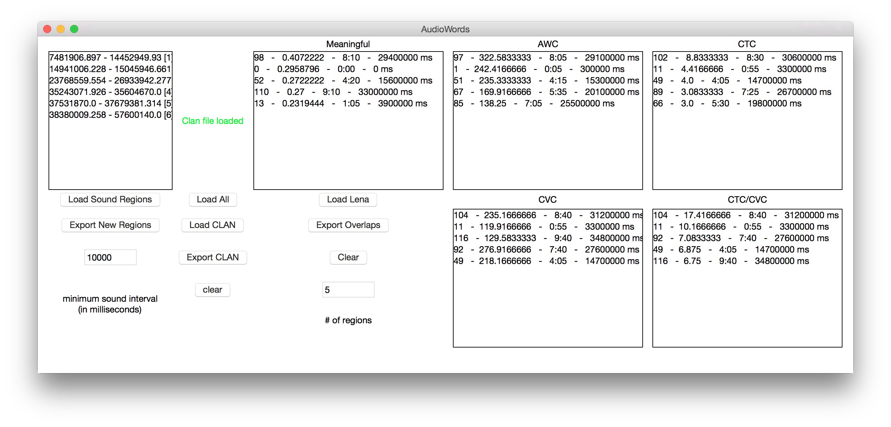

#audiowords

This program automates a few tasks involved in ignoring silent regions within CLAN files, finding the most densely populated hours within audio recordings (# of words), and inserting appropriate comments into CLAN files.


##running

```bash
$ python audiowords.py
```


###new process

1. Click "Load All" and select the main CLAN file (e.g 16_08.cex)


The program will load and generate the other files that are necessary, running through all the steps at once.
It assumes that all the necessary files are within the same directory as the original CLAN file that was loaded.
It will output the silences_added and subregions exports to this same directory.
The old functionality is still in place, so if you want to load/export
everything one at a time, you can still do that. You should read the directions to the old process
because some of the elements are still relevant (like working with audacity regions)

The format it's expecting files to be in:

    16_08.cex
    16_08_silences.txt
    16_08_lena5min.csv

    16_08_silences_added.cex   <--////////////////////////////////////////
                                 // These will be output by audiowords //
    16_08_subregions.cex     <--////////////////////////////////////////

###old process (still functional)

1. a window called AudioWords should pop up. Set the minimum sound interval to 10000 (this is 10s) [you may edit this value later; or if you already checked the silences in audacity, make this 0].
  * What this does is find stretches of this length that interrupt longer silences, and makes new timestamps that ignore them.
2. Click 'Load Sound Regions' to select the audacity regions file you made, e.g. 01_06_audacityregions.txt
3. Click "Export New Regions" to export the newly edited regions, naming the file with the word silences, e.g. 01_06_silences.txt [This can then be read back into audacity to check if it did a good job by file->import->labels in audacity]
  * if there are as many silences in the audio words window as you were expending when you ran the sound finder above, go ahead and proceed.
    * (If not, read the silent regions back into audacity, and tinker with the length of the minimum sound interval (ask Elika/Munna for help))
4. Click "Load Clan File" and navigate to the appropriate folder to load the .cex clan file you made in the previous section (e.g. 01_06.fxblts.cex)
5. Click Export Clan file, and save the file in the "files" folder in "audiowords" as, e.g. 01_06_silences_added.cex
  * the python window will give you a red error message "clan file malformed" above where it says 'load clan file' if something didn't work.
6. Open the new file in CLAN by double clicking it and find the word "silence 1" by pressing control+F (or edit->Find) to make sure it worked.
7. If it looks good, move the .cex and silences files back into the the subjects' folder and proceed to the annotation stage.
8. At the end of this process, in the subjects' folder you should have:
  * The properly named wave file (e.g. 01_06_audio.wav)
  * The properly named clan file (e.g. 01_06.fxblts.cex)
  * The silences file (e.g. 01_06_silences.txt)
  * The silences_added clan file (e.g. 01_06_silences_added.cex). This is the file you will start with for your annotation



